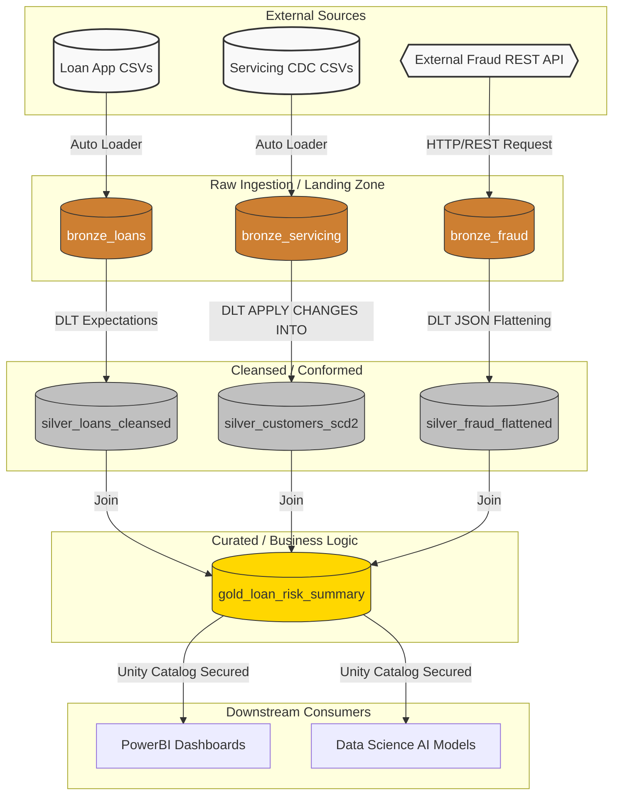

# Mortgage Data Platform (MDP) - Project Architecture

Welcome to the core codebase of the Mortgage Data Platform! This document serves as the architectural blueprint for the PySpark and Databricks code contained in this directory.

## 1. Business Context

A national mortgage lender receives thousands of loan applications daily. To manage risk and comply with financial regulations, the data engineering team is tasked with building a highly scalable, secure, and automated Data Lakehouse. 

The platform must:
1. **Ingest** massive volumes of loan application files efficiently.
2. **Cleanse** and conform the data, updating customer records as they change over time (e.g., a customer updates their address or their credit score drops).
3. **Secure** the platform by masking Personally Identifiable Information (PII) like Social Security Numbers (SSNs).
4. **Detect Risk** by cross-referencing applicants against a 3rd-party Fraud API Blacklist.
5. **Serve** the final, aggregated data to BI Analysts (PowerBI) and Data Scientists for default risk modeling.

---

## 2. Architecture Diagram

The platform utilizes a strictly governed **Medallion Architecture** (Bronze, Silver, Gold), built primarily using **Delta Live Tables (DLT)** for declarative pipeline execution, and orchestrated by **Databricks Workflows**.

---

## 3. Data Flow Deep-Dive

### Step 1: Ingestion to Bronze (Auto Loader & API Ingestion)
We use two primary ingestion methods to land data in the Bronze layer:
- **Auto Loader (`cloudFiles`):** We use this to incrementally stream raw CSVs (Loans and CDC events) from Azure Data Lake Storage (ADLS Gen2). 
  - **Why Auto Loader?** It automatically manages state using RocksDB. If a million files are dumped into the lake, Auto Loader instantly knows exactly which files are new without having to scan the entire directory tree. It also seamlessly handles **Schema Drift** if new columns appear.
- **REST API Ingestion (Python/HTTP):** For the Fraud Blacklist, we use a scheduled Python batch job (using the `requests` library) to hit a 3rd-party REST API, retrieve the JSON payload, and write it directly into the Bronze landing zone. This demonstrates the platform's ability to integrate with external web services securely using Key Vault secrets.

### Step 2: Cleansing to Silver (Delta Live Tables & CDC)
The Bronze data is transformed into Silver using **Delta Live Tables (DLT)**.
- **Data Quality:** We enforce DLT "Expectations" (e.g., `@dlt.expect_or_drop("valid_ssn", "ssn IS NOT NULL")`). If an application arrives without an SSN, it is instantly dropped, ensuring garbage data never pollutes the Silver layer.
- **Change Data Capture (CDC):** We use the DLT `APPLY CHANGES INTO` API to handle the `servicing_events`. If a customer's credit score changes, DLT automatically performs a Type 1 (overwrite) or Type 2 (history tracking) merge without us having to write complex SQL `MERGE` statements.
- **Security:** We use Unity Catalog dynamic masking to obscure SSNs and PII at this layer.

### Step 3: Aggregation to Gold (Business Logic)
We perform wide joins across the Silver tables to create `gold_loan_risk_summary`. 
- We cross-reference the applicant's SSN or Email with the flattened Fraud Blacklist.
- We aggregate total loan exposure by zip code.
- This read-optimized Delta table is clustered using **Liquid Clustering** to provide lightning-fast query performance for PowerBI dashboards.

---

## 4. 🎯 Senior-Level Interview Talking Points

If you are discussing this architecture in an interview, here are the exact talking points to demonstrate senior-level expertise:

> [!TIP]
> **On Choosing DLT over traditional PySpark Streaming:**
> "I prefer Delta Live Tables (DLT) for the Silver layer because it allows me to write declarative data pipelines. Instead of managing complex checkpointing, state, and `MERGE` logic manually, I declare the desired end-state of the table, and DLT's engine figures out the most efficient way to update it. It also natively tracks data lineage and allows me to implement Data Quality constraints (Expectations) directly in the code, which is critical for financial compliance."

> [!TIP]
> **On Handling Updates (CDC):**
> "In the mortgage space, data changes constantly (e.g., credit scores drop, addresses change). Handling Change Data Capture manually in PySpark requires complex, error-prone `MERGE` syntax. By utilizing DLT's `APPLY CHANGES INTO` API, I can implement SCD Type 1 or Type 2 tracking with just a few lines of configuration, drastically reducing technical debt."

> [!TIP]
> **On CI/CD and Deployments:**
> "I do not use the Databricks UI to schedule jobs in production. I treat all infrastructure as code. I use **Databricks Asset Bundles (DABs)** to define my DLT pipelines, workflows, and cluster configurations in a `databricks.yml` file. This allows me to integrate seamlessly with GitHub Actions, pushing code through Dev, Staging, and Prod environments with strict CI/CD gates."

> [!TIP]
> **On Performance Optimization:**
> "For the Gold layer, instead of relying on legacy hive-style partitioning (which can lead to the 'small files problem'), I utilize Delta Lake's **Liquid Clustering**. Liquid clustering dynamically adapts the data layout based on query patterns, ensuring BI analysts experience sub-second latency in PowerBI without me having to constantly run `OPTIMIZE` and `ZORDER` maintenance jobs."

> [!TIP]
> **On Integrating External REST APIs:**
> "When ingesting data from external APIs (like our Fraud Blacklist), I do not embed the API calls directly into my Spark transformations because Spark's distributed nature makes it difficult to manage rate limits and API quotas. Instead, I write a dedicated Python ingestion script that fetches the JSON payload via HTTP and lands it in a raw Bronze ADLS path. From there, I use Auto Loader to seamlessly ingest that JSON into the Delta Lakehouse for distributed processing."
